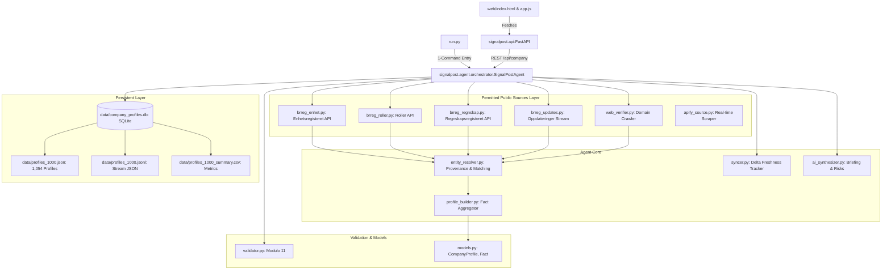

# SignalPost Architecture Knowledge Graph (/graphify)
> Token-optimized knowledge graph for AI agents and LLMs. Compresses full repository architecture, data flows, and constraints into minimal tokens.

## 1. Relational Graph (Mermaid DSL)



---

## 2. Dense Entity-Relation Index (Token-Optimized)

```json
{
  "project": "SignalPost",
  "domain": "Norwegian Corporate Intelligence",
  "license": "NLOD 2.0 / CC BY 4.0 (Free Norwegian Open Data)",
  "nodes": {
    "run.py": {"type": "cli_entry", "exec": "python run.py --serve | --orgnr <id> | --batch 1000"},
    "validator": {"weights": [3,2,7,6,5,4,3,2], "algorithm": "Modulo 11", "target": "9-digit orgnr"},
    "enhetsregisteret": {"endpoint": "https://data.brreg.no/enhetsregisteret/api/enheter/{orgnr}", "output": "name, form, address, NACE, employees, status"},
    "roller": {"endpoint": "https://data.brreg.no/enhetsregisteret/api/enheter/{orgnr}/roller", "output": "CEO, Chair, Board, Auditor"},
    "regnskap": {"endpoint": "https://data.brreg.no/regnskapsregisteret/regnskap/{orgnr}", "output": "revenue, EBIT, net_profit, assets, equity"},
    "oppdateringer": {"endpoint": "https://data.brreg.no/enhetsregisteret/api/oppdateringer/enheter", "output": "update_id, timestamp, delta_events"},
    "entity_resolver": {"rules": ["orgnr_primary_key_invariance", "levenshtein_name_similarity>=0.82", "historical_name_matching"]},
    "syncer": {"evaluates": ["latest_update_id > cached_id", "registry_timestamp > cached_timestamp", "ttl_hours=48"]},
    "dataset": {"records": 1054, "facts": 11837, "formats": ["json", "jsonl", "csv", "db"]}
  },
  "edges": [
    ["run.py", "CALLS", "SignalPostAgent"],
    ["SignalPostAgent", "VALIDATES_WITH", "validator"],
    ["SignalPostAgent", "QUERIES", "enhetsregisteret"],
    ["SignalPostAgent", "QUERIES", "roller"],
    ["SignalPostAgent", "QUERIES", "regnskap"],
    ["SignalPostAgent", "MONITORS_DELTA", "oppdateringer"],
    ["enhetsregisteret", "DISAMBIGUATED_BY", "entity_resolver"],
    ["entity_resolver", "GROUNDS_INTO", "profile_builder"],
    ["profile_builder", "STORES_INTO", "data/company_profiles.db"]
  ]
}
```

---

## 3. Operational Invariants
- `INV-01`: Every fact MUST carry `source_name`, `source_url`, `source_date`, and `confidence`.
- `INV-02`: Orgnr must pass Modulo 11 check before any network request is issued.
- `INV-03`: Zero external data costs — all registry queries target sovereign Norwegian open APIs.
- `INV-04`: Frontend presentation remains clean & retro-editorial; backend telemetry is segregated into `/api/stats` and dedicated inspector views.
