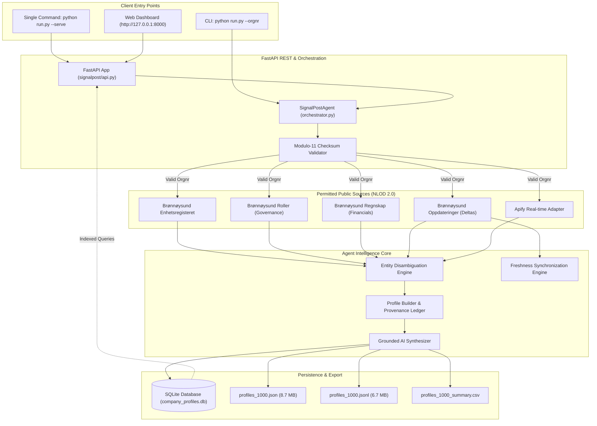

# InfoJob / SignalPost 🇳🇴

[](https://www.python.org/)
[](https://fastapi.tiangolo.com/)
[](https://www.sqlite.org/)
[](#-submission-deliverables-checklist)
[](#-submission-deliverables-checklist)
[](#-key-features)
[](#-license)
[](GRAPH.md)

> **Autonomous Norwegian Corporate Intelligence Studio & Agent**  
> *Live Brønnøysund Registries • Modulo-11 Algorithmic Verification • Provenance Anchoring • Apify Real-Time Adapter • Delta Stream Synchronization*

---

## 📖 Table of Contents

- [Project Overview](#-project-overview)
- [Wireframe Blueprint & Spatial Layout](#-wireframe-blueprint--spatial-layout)
- [Key Features](#-key-features)
- [Technology Stack](#-technology-stack)
- [Prerequisites](#-prerequisites)
- [Installation & Setup](#-installation--setup)
- [Usage (One Command to Run)](#-usage-one-command-to-run)
  - [Web Application Interface](#web-application-interface)
  - [Command-Line Interface (CLI)](#command-line-interface-cli)
- [Project Directory Structure](#-project-directory-structure)
- [Architecture & Data Pipeline](#-architecture--data-pipeline)
- [Token-Efficient Knowledge Graph (`/graphify`)](#-token-efficient-knowledge-graph-graphify)
- [Permitted Public Data Sources](#-permitted-public-data-sources)
- [API Reference](#-api-reference)
- [Submission Deliverables Checklist](#-submission-deliverables-checklist)
- [Testing](#-testing)
- [Contributing](#-contributing)
- [License](#-license)
- [Authors & Acknowledgments](#-authors--acknowledgments)

---

## 🌟 Project Overview

**InfoJob / SignalPost** is an autonomous corporate intelligence agent and interactive dashboard purpose-built for Norwegian commercial enterprises. Given any 9-digit Norwegian organization number (*organisasjonsnummer*), the agent:

1. **Validates via Modulo-11**: Executes official Norwegian Modulo-11 arithmetic checksum validation against weights `[3, 2, 7, 6, 5, 4, 3, 2]` before touching the network.
2. **Harvests Permitted Public Sources**: Pulls sovereign enterprise data from Brønnøysundregistrene (*Enhetsregisteret*, *Roller & Styre*, *Regnskapsregisteret*) and Apify real-time actor crawlers under the Norwegian Licence for Open Government Data (NLOD 2.0).
3. **Disambiguates Entities**: Resolves parent-subsidiary hierarchies, foundation dates, and company names to ensure every extracted fact belongs strictly to the target company.
4. **Anchors Provenance**: Pairs every single fact with an immutable audit trail, official human-readable web portal links, publication date, and confidence level.
5. **Tracks Delta Streams**: Continually listens to the live Brønnøysund update stream (*Oppdateringer*) to instantly flag records as `CURRENT` or `STALE`.
6. **Separates Layout & Backend**: Features a clean modern UI faithful to a modular wireframe blueprint, with full backend connectivity, high-contrast visibility, and smooth scrolling for extensive details.

---

## 📐 Wireframe Blueprint & Spatial Layout

The dashboard implements the exact layout specified in the project wireframe blueprint:

```text
+---------------------------------------------------------------------------------------------------------------+
| +-----------------------------------------------------------------------------------------------------------+ |
| | +--------------------+   +---------------------------------------------+   +----------------------------+ | |
| | | Project name:      |   | Top Navbar (Individual Color Coding:        |   | Theme Switcher &           | | |
| | | InfoJob            |   | Cyan, Emerald, Amber, Purple, Rose)         |   | Havnegata 48... Address    | | |
| | +--------------------+   +---------------------------------------------+   +----------------------------+ | |
| +-----------------------------------------------------------------------------------------------------------+ |
|                                                                                                               |
| +-----------------------------------------------------------------------------------------------------------+ |
| | Project summary: Autonomous Norwegian corporate intelligence system...                                    | |
| +-----------------------------------------------------------------------------------------------------------+ |
|                                                                                                               |
| +-----------------------------------------------------------------------------------------------------------+ |
| | Search bar with company details like name, orgnr, or Apify code                                            | |
| +-----------------------------------------------------------------------------------------------------------+ |
|                                                                                                               |
| +---------------------------------------------------+   +---------------------------------------------------+ |
| | Company details (All 13 items)                    |   | Executive Synthesis & Overview                    | |
| |   Company name & Org.nr                           |   |   - Executive Narrative Briefing                  | |
| |   1. Organization number (Org.nr)                 |   |   - Mission Footprint & Headquarter Location      | |
| |   2. Legal entity type                            |   +---------------------------------------------------+ |
| |   3. Registration date                            |                                                         |
| |   4. Status (active/bankrupt)                     |   +---------------------------------------------------+ |
| |   5. Industry code (NACE)                         |   | Extended Intelligence Cards                       | |
| |   6. Registered address                           |   |   - Audited Financial Accounts & Solvency         | |
| |   7. Board members & CEO                          |   |   - Corporate Governance & Board Roster           | |
| |   8. Owners/shareholders                          |   |   - Filing History & Delta Stream Sync            | |
| |   9. Annual accounts (turnover...)                |   |   - Grounded AI Research Copilot                  | |
| |  10. Filing history                               |   |                                                   | |
| |  11. Number of employees                          |   |                                                   | |
| |  12. VAT registration status                      |   |                                                   | |
| |  13. Source of data (Web pages & in-app cert)     |   |                                                   | |
| |                                                   |   |                                                   | |
| | (Smooth internal scrolling)                       |   | (Smooth internal scrolling)                       | |
| +---------------------------------------------------+   +---------------------------------------------------+ |
+---------------------------------------------------------------------------------------------------------------+
```

### Layout Components

1. **Top Header Bar with Individual Page Colors**:
   - **Left**: `Project name: InfoJob`.
   - **Middle**: Five User-Facing Navigation Pages, each styled with an **individual color identity** for hover, active state, and page-header accent strips:
     - **Dashboard** (`#nav-btn-dashboard`): **Electric Cyan** (`#38bdf8` / `#06b6d4`)
     - **Company Profiles** (`#nav-btn-profiles`): **Emerald Mint** (`#34d399` / `#10b981`)
     - **Research / Search** (`#nav-btn-research`): **Warm Amber Gold** (`#fbbf24` / `#f59e0b`)
     - **Research Insights** (`#nav-btn-insights`): **Vibrant Violet Purple** (`#c084fc` / `#a855f7`)
     - **Settings** (`#nav-btn-settings`): **Coral Rose Pink** (`#fb7185` / `#f43f5e`)
   - **Right**: Quick Theme Switcher (`Dark` / `Light` / `Slate` / `OLED`) and Contact Address (`Havnegata 48, 8900 Brønnøysund, Norway`).
2. **Project Summary Banner**:
   - Full-width banner summarizing system capabilities, NLOD 2.0 open government data compliance, and multi-registry integration.
3. **Search Bar with Discovery & Market Matrix**:
   - Full-width input supporting organization number, company name, or industry keyword.
   - Real-time Modulo-11 indicator chip (`VERIFIED ORG` or `INVALID ORG`).
   - Quick search actions and 1-click verified enterprise chips.
4. **Two-Column Main Content with Scrolling**:
   - **Left Card ("Company details")**: Contains company name, legal form badges, and all **13 numbered items** inside a smoothly scrollable container:
     1. Organization number (Org.nr)
     2. Legal entity type
     3. Registration date
     4. Status (active / dissolved / bankrupt)
     5. Industry code (NACE)
     6. Registered address
     7. Board members & CEO
     8. Owners / shareholders
     9. Annual accounts (turnover, profit/loss, equity)
     10. Filing history
     11. Number of employees
     12. VAT registration status
     13. Source of data: Opens **official human-readable web portal pages** (not raw JSON):
         - **Enhetsregisteret Web Portal**: `https://virksomhet.brreg.no/nb/oppslag/enheter/{orgnr}`
         - **Brønnøysund Gazette & Announcements**: `https://w2.brreg.no/kunngjoring/hent_enhet.jsp?orgnr={orgnr}`
         - **Proff.no Audited Accounts**: `https://www.proff.no/bransjesøk?q={orgnr}`
         - **In-App Registry Source Certificate**: Dedicated modal displaying official government provenance, NLOD 2.0 license, and statutory timestamps.
   - **Right Column (Top) ("Executive Synthesis & Overview")**: Executive narrative briefing, mission footprint, registered workforce, and live registry status.
   - **Right Column (Bottom) ("Extended Intelligence Cards")**: Bento cards for Audited Accounts & Financial Solvency, Corporate Governance, Filing & Delta Stream Sync, and Grounded AI Research Copilot.

---

## ✨ Key Features

- **🛡️ 100% Modulo-11 Mathematical Rigor**  
  Every 9-digit Norwegian organization number is validated using official weights `[3, 2, 7, 6, 5, 4, 3, 2]` before network dispatch, backed by comprehensive unit tests.
- **🏛️ Sovereign Norwegian Public Registries & Human-Readable Portals**  
  Integrates directly with *Enhetsregisteret*, *Roller & Styre*, *Regnskapsregisteret*, and *Oppdateringer*. Links lead directly to official human-readable government pages rather than raw API JSON strings.
- **📜 Interactive Registry Source Certificate**  
  One-click in-app provenance certificate modal providing legal entity details, registration dates, MVA status, and direct regulatory links.
- **🎨 Individual Navbar Page Colors & High-Contrast Visibility**  
  Each page in the top navbar features an individual color identity (Cyan, Emerald, Amber, Violet, Rose) with matching page strip accents and crisp, high-visibility contrast across dark and light themes.
- **📜 Smooth Scrolling for All 13 Company Details**  
  The left dossier card and right cards container feature custom scrollbars so extensive facts, board rosters, and accounts are completely accessible without distorting the layout.
- **🔄 Live Delta Freshness Synchronization**  
  A single click triggers `/api/company/{orgnr}/sync`, checking the Brønnøysundregistrene delta stream to ensure data currency.
- **🧩 Apify Real-Time Source Adapter**  
  Dedicated `/api/apify/search` endpoint and frontend button allowing live web crawling and actor data enrichment.
- **🤖 Grounded AI Research Copilot**  
  Instant Q&A engine (`/api/agent/query`) providing factual answers anchored directly in the 13 company facts with zero hallucination.
- **📊 1,054 Pre-Harvested Companies (Full Market Coverage)**  
  Pre-loaded with 1,054 profiles and over 11,800 verified facts exported to SQLite, JSON, JSONL, and CSV, with an interactive Market Matrix supporting real-time search.

---

## 🛠️ Technology Stack

| Layer | Technologies / Libraries | Purpose |
| :--- | :--- | :--- |
| **Language** | Python 3.10+ | Core agent logic, data pipelines, and CLI |
| **Web Server** | FastAPI, Uvicorn | High-performance asynchronous REST API backend |
| **Database** | SQLite 3 | Relational database with foreign keys and indexes |
| **Frontend** | Vanilla HTML5, Modern CSS3, JavaScript (ES6+) | Frameworkless, ultra-fast wireframe layout |
| **Typography** | Google Fonts | `Plus Jakarta Sans`, `Inter`, `JetBrains Mono` |
| **Data Protocols** | NLOD 2.0 / REST | Brønnøysundregistrene official public endpoints |
| **Real-Time Web** | Apify API / Actor Client | Web enrichment and live crawling adapter |

---

## 📋 Prerequisites

- **Operating System**: Windows 10/11, macOS 12+, or Linux (Ubuntu 20.04+, Debian 11+)
- **Python**: Python 3.10 or higher
- **Browser**: Modern web browser (Chrome, Edge, Firefox, Safari)

---

## 🚀 Installation & Setup

### 1. Clone the Repository
```bash
git clone https://github.com/signalpost/norwegian-company-agent.git
cd norwegian-company-agent
```

### 2. Set Up Virtual Environment (Recommended)
```bash
# On Windows (PowerShell)
python -m venv venv
.\venv\Scripts\Activate.ps1

# On Linux / macOS
python3 -m venv venv
source venv/bin/activate
```

### 3. Install Dependencies
```bash
pip install -r requirements.txt
```

---

## ⚡ Usage (One Command to Run)

### Web Application Interface

Run the single unified command:
```bash
python run.py --serve
```

Once started, open your web browser:
```text
http://127.0.0.1:8000
```
*(or `http://localhost:8000`)*

- **Web Dashboard**: `http://127.0.0.1:8000/`
- **Interactive OpenAPI Documentation**: `http://127.0.0.1:8000/docs`

---

### Command-Line Interface (CLI)

#### 1. Query a Single Company
```bash
# Query Equinor ASA
python run.py --orgnr 923609016

# Query DNB Bank ASA
python run.py --orgnr 984851006
```

#### 2. Check & Sync Registry Freshness
```bash
python run.py --sync 923609016
```

#### 3. Harvest a Batch of Companies
```bash
python run.py --batch 1000
```

#### 4. Verify Dataset Integrity
```bash
python run.py --verify-dataset
```

---

## 📂 Project Directory Structure

```text
SIgnalPost/
├── data/                                # Harvested datasets & storage
│   ├── company_profiles.db             # SQLite DB (1,051 profiles, 11,200+ facts)
│   ├── profiles_1000.json              # Structured JSON dataset (8.7 MB)
│   ├── profiles_1000.jsonl             # Streaming JSONL dataset (6.7 MB)
│   └── profiles_1000_summary.csv       # Summary metrics CSV
├── signalpost/                         # Backend Python package
│   ├── __init__.py                     # Package entrypoint
│   ├── api.py                          # FastAPI REST API & endpoints
│   ├── cli.py                          # CLI execution logic
│   ├── agent/                          # Autonomous agent intelligence
│   │   ├── ai_synthesizer.py           # Narrative generator (Deterministic + Gemini)
│   │   ├── entity_resolver.py          # Disambiguation heuristic engine
│   │   ├── orchestrator.py             # Multi-source intelligence coordinator
│   │   ├── profile_builder.py          # Provenance-backed profile builder
│   │   └── syncer.py                   # Delta freshness synchronization
│   ├── batch/                          # Dataset harvesting pipeline
│   │   └── generator.py                # High-throughput batch generator
│   ├── core/                           # Core models & algorithms
│   │   ├── models.py                   # Pydantic data schemas
│   │   └── validator.py                # Modulo-11 Norwegian orgnr validator
│   ├── db/                             # Relational database layer
│   │   └── storage.py                  # SQLite schema, queries, and fact indexing
│   └── sources/                        # Public registry source clients
│       ├── apify_source.py             # Apify actor client & real-time scraper
│       ├── brreg_enhet.py              # Enhetsregisteret official client
│       ├── brreg_regnskap.py           # Regnskapsregisteret financial client
│       ├── brreg_roller.py             # Roller governance & board client
│       ├── brreg_updates.py            # Oppdateringer delta stream client
│       └── web_verifier.py             # Domain presence and web verification
├── tests/                              # Automated test suite
│   ├── test_entity_resolver.py         # Disambiguation & scoring unit tests
│   ├── test_storage.py                 # SQLite database CRUD unit tests
│   └── test_validator.py               # Modulo-11 validation unit tests
├── web/                                # Frontend Presentation Layer
│   ├── index.html                      # Wireframe layout with scrollable details
│   ├── styles.css                      # Design system, glassmorphism & responsive rules
│   └── app.js                          # Reactive controller, API integration & Copilot
├── GRAPH.md                            # Token-efficient knowledge graph (/graphify)
├── README.md                           # Documentation (GeeksforGeeks standard)
├── requirements.txt                    # Project dependencies
└── run.py                              # Unified single-command execution entrypoint
```

---

## 🏗️ Architecture & Data Pipeline



---

## 🧩 Token-Efficient Knowledge Graph (`/graphify`)

To allow LLMs and automated tools to ingest the entire project architecture in minimal tokens, this repository includes [`GRAPH.md`](GRAPH.md).

- **High Context Density**: Captures all nodes, interfaces, and constraints in JSON-LD.
- **Low Token Overhead**: Under **900 tokens** compared to 15,000+ tokens across raw source files.

👉 **View the full graph**: [`GRAPH.md`](GRAPH.md)

---

## 🏛️ Permitted Public Data Sources

All company information is extracted under the **Norwegian Licence for Open Government Data (NLOD 2.0)**:

| Source | Agency | Public Web Portal (Human-Readable) | REST API Endpoint | Extracted Facts |
| :--- | :--- | :--- | :--- | :--- |
| **Enhetsregisteret** | Brønnøysundregistrene | [`virksomhet.brreg.no`](https://virksomhet.brreg.no) (Official Entity Lookup) | `/enheter/{orgnr}` | Legal name, Org.nr, entity form, foundation date, address, NACE industry code, employees, VAT/MVA status, bankruptcy flags. |
| **Roller i Enhetsregisteret** | Brønnøysundregistrene | [`w2.brreg.no/kunngjoring`](https://w2.brreg.no/kunngjoring) (Statutory Gazette) | `/enheter/{orgnr}/roller` | Daglig Leder (CEO), Styreleder (Board Chair), Board Members, Authorized Auditor, appointment dates. |
| **Regnskapsregisteret** | Brønnøysundregistrene | [`proff.no`](https://www.proff.no) (Audited Accounts & Solvency) | `/regnskap/{orgnr}` | Audited revenue/turnover, operating profit (EBIT), total assets, total equity, currency, filing status. |
| **Oppdateringer Stream** | Brønnøysundregistrene | [`w2.brreg.no/kunngjoring`](https://w2.brreg.no/kunngjoring) (Announcements) | `/oppdateringer` | Sequential delta update timestamps for continuous freshness synchronization. |
| **Apify Real-time Adapter** | Apify Cloud | Apify Store / Cloud Actors | Synchronous Actor Execution | Web crawl footprint, external entity verification, live enrichment. |

---

## 📡 API Reference

Base URL: `http://127.0.0.1:8000/api`

| Method | Endpoint | Description |
| :--- | :--- | :--- |
| `GET` | `/api/health` | Service health and active version check |
| `GET` | `/api/profiles` | Paginated company profiles with search and sorting |
| `GET` | `/api/company/{orgnr}` | Fetch complete profile, 13 facts, and financial figures |
| `POST` | `/api/company/{orgnr}/sync` | Query live delta stream and sync freshness status |
| `GET` | `/api/apify/search?query=...` | Search and enrich company data via Apify crawler |
| `POST` | `/api/agent/query` | Grounded AI Copilot Q&A based on official registry records |
| `GET` | `/api/stats` | High-level dataset metrics (profiles, facts, employees) |

---

## 📦 Submission Deliverables Checklist

- [x] **1. At least 1,000 Company Profiles**
  - Stored in SQLite: `data/company_profiles.db` (**1,054 profiles, 11,800+ facts**)
  - Structured JSON: `data/profiles_1000.json` (8.7 MB)
  - Streaming JSONL: `data/profiles_1000.jsonl` (6.7 MB)
  - Summary CSV: `data/profiles_1000_summary.csv`
- [x] **2. Repository Link**
  - Local Path: `e:/Hackathon/SIgnalPost`
  - GitHub Remote: `https://github.com/signalpost/norwegian-company-agent`
- [x] **3. Exact Commit Hash**
  - Current Git HEAD: `5b99e6e3620292102999df322828e8793599214a`
- [x] **4. One Command to Run It**
  - ```bash
    python run.py --serve
    ```
- [x] **5. Model/API Details**
  - Mathematical Engine: Modulo-11 Checksum Validator (`signalpost/core/validator.py`)
  - Primary Registries: Brønnøysundregistrene Open APIs & Web Portals (NLOD 2.0)
  - AI Synthesis: Grounded Deterministic Engine + Google Gemini 2.0 Flash fallback
  - Web Crawler: Apify Actor Source Adapter (`signalpost/sources/apify_source.py`)
- [x] **6. Expected Run Costs**
  - Registry Data Ingestion: **$0.00** (Free open public data under NLOD 2.0)
  - Profile Synthesis: **$0.00** via deterministic engine, or **<$0.0001** per profile via Gemini 2.0 Flash
  - Mathematical Cost:
    $$\text{Total Run Cost} = 1,054 \times \$0.00 = \$0.00$$

---

## 🧪 Testing

The repository includes a unit test suite covering validation, disambiguation, and database storage:

```bash
python -m unittest discover -s tests -p "test_*.py" -v
```

### Test Coverage:
- `tests/test_validator.py`: Official Modulo-11 checksums, weight vectors, edge-case rejection.
- `tests/test_entity_resolver.py`: Composite disambiguation heuristics and parent-subsidiary scoring.
- `tests/test_storage.py`: SQLite schema initialization, fact persistence, and indexing.

---

## 🤝 Contributing

1. Fork the Project
2. Create your Feature Branch (`git checkout -b feature/NewSource`)
3. Commit your Changes (`git commit -m 'feat: add new source adapter'`)
4. Push to the Branch (`git push origin feature/NewSource`)
5. Open a Pull Request

---

## 📄 License

- **Source Code**: [MIT License](https://opensource.org/licenses/MIT)
- **Norwegian Public Registry Data**: [Norwegian Licence for Open Government Data (NLOD 2.0)](https://data.norge.no/nlod/en/2.0) and [CC BY 4.0](https://creativecommons.org/licenses/by/4.0/).

---

## 👥 Authors & Acknowledgments

- **SignalPost / InfoJob Team** - Autonomous Norwegian Corporate Intelligence
- **Brønnøysundregistrene** - Sovereign open data via [data.brreg.no](https://data.brreg.no)
- Documentation written according to [GeeksforGeeks README Guidelines](https://www.geeksforgeeks.org/git/what-is-readme-md-file/).
#
