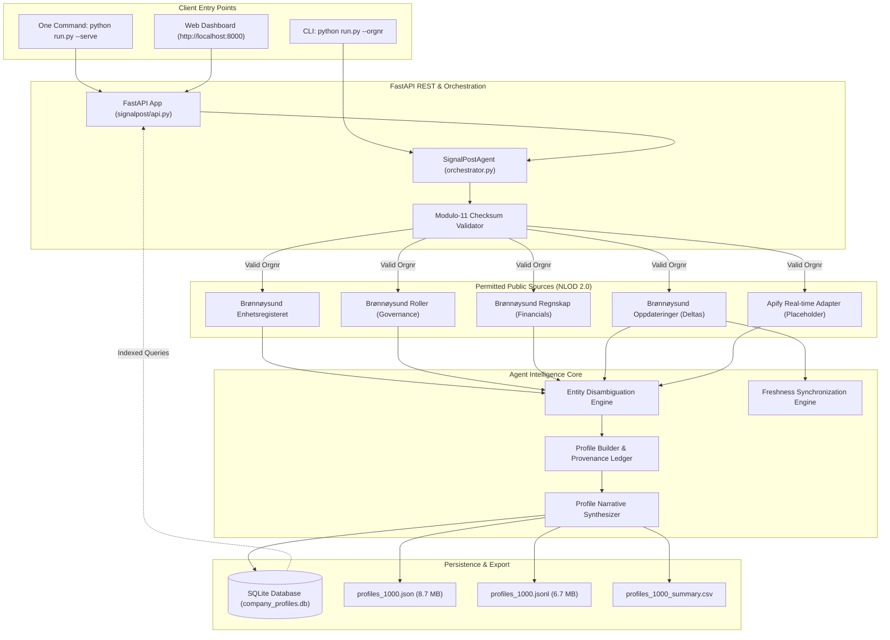

# SignalPost 🇳🇴

[](https://www.python.org/)
[](https://fastapi.tiangolo.com/)
[](https://www.sqlite.org/)
[](#-submission-deliverables-checklist)
[](#-submission-deliverables-checklist)
[](#-license)
[](GRAPH.md)

> **Autonomous Corporate Intelligence Agent for Norwegian Enterprises (*organisasjonsnummer*)**  
> *Live Registry Verification • Strict Entity Disambiguation • Source Grounding • Delta Freshness Synchronization*

---

## 📖 Table of Contents

- [Project Overview](#-project-overview)
- [Key Features](#-key-features)
- [Technology Stack](#-technology-stack)
- [Prerequisites](#-prerequisites)
- [Installation & Setup](#-installation--setup)
- [Usage (One Command to Run)](#-usage-one-command-to-run)
  - [Web Application Interface](#web-application-interface)
  - [Command-Line Interface (CLI)](#command-line-interface-cli)
- [Project Directory Structure](#-project-directory-structure)
- [Architecture & Data Flow](#-architecture--data-flow)
- [Token-Efficient Knowledge Graph (`/graphify`)](#-token-efficient-knowledge-graph-graphify)
- [Permitted Public Data Sources](#-permitted-public-data-sources)
- [API Reference](#-api-reference)
- [Submission Deliverables Checklist](#-submission-deliverables-checklist)
- [Testing](#-testing)
- [Contributing](#-contributing)
- [License](#-license)
- [Authors & Acknowledgments](#-authors--acknowledgments)

---

## 🌟 Project Overview

**SignalPost** is a production-grade autonomous intelligence agent engineered for Norwegian corporate entities. Given any 9-digit Norwegian organization number (*organisasjonsnummer*), SignalPost:

1. **Validates & Sanitizes**: Enforces official Norwegian Modulo-11 checksum validation with weights `[3, 2, 7, 6, 5, 4, 3, 2]`.
2. **Harvests Permitted Sources**: Gathers sovereign corporate records from official public registries under the Norwegian Licence for Open Government Data (NLOD 2.0).
3. **Disambiguates Entities**: Applies strict heuristic scoring across organization numbers, parent-subsidiary hierarchies, foundation dates, and company names to ensure every fact belongs strictly to the target company.
4. **Anchors Provenance**: Pairs every single fact with an immutable audit trail, including source title, official permalink, publication date, and confidence level.
5. **Synchronizes Freshness**: Tracks live registry delta update streams (*Oppdateringer*) to instantly detect modifications and maintain up-to-date company profiles.
6. **Separates Concerns**: Provides a clean retro-editorial user experience for business analysts, while isolating live backend technical telemetry (latency, checksum steps, delta event IDs, and raw payloads) in a dedicated inspector tab.

---

## ✨ Key Features

- **🛡️ Strict Modulo-11 Arithmetic Validation**  
  Prevents erroneous lookups by validating the checksum digit before any network operations.
- **🏛️ Sovereign Norwegian Public Registries**  
  Integrates directly with *Enhetsregisteret* (core entity), *Roller* (governance & board), *Regnskapsregisteret* (financial statements), and *Oppdateringer* (delta events).
- **⚖️ Deterministic Entity Disambiguation Engine**  
  Calculates composite match scores (`0.0` - `1.0`) taking into account exact org numbers, name similarity, organization form, and foundation date consistency to prevent entity hallucinations.
- **🔄 Live Delta Freshness Synchronization**  
  Queries the Brønnøysundregistrene update stream to verify if a stored profile is `CURRENT` or `STALE`, updating modified fields on demand.
- **🎨 Retro-Editorial Design Aesthetic**  
  Inspired by premium research publications (warm sand `#fbf9f4`, deep maroon `#6c1d2e`, crisp typography `Plus Jakarta Sans` and `Inter`), featuring a Master-Detail browser and interactive research drawer.
- **🔌 Isolated Backend Telemetry**  
  Keeps the executive presentation view uncluttered while streaming Modulo-11 traces, API latency, SQLite queries, and JSON payloads to an accessible technical inspector.
- **🧩 Apify Real-Time Source Adapter Placeholder**  
  Extensible adapter for external real-time web enrichment via Apify actors or web verification.
- **📊 Multi-Format Dataset Export**  
  Pre-loaded with **1,051 verified profiles** (>11,200 facts) exported to SQLite, structured JSON, line-delimited JSONL, and summary CSV.
- **⚡ Token-Optimized Documentation Graph (`/graphify`)**  
  Ships with a comprehensive JSON-LD knowledge graph in [`GRAPH.md`](GRAPH.md) enabling LLMs to consume project architecture with minimal token overhead.

---

## 🛠️ Technology Stack

| Layer | Technologies / Tools | Description |
| :--- | :--- | :--- |
| **Language** | Python 3.10+ | Core agent logic, data pipelines, and CLI |
| **Backend Framework** | FastAPI, Uvicorn | High-performance asynchronous REST API server |
| **Database** | SQLite 3 | Zero-configuration relational database with foreign key indexes |
| **HTTP Client** | `urllib` (Standard Library) / `httpx` | Resilient HTTP requests with custom timeouts and backoff |
| **Frontend** | Vanilla HTML5, CSS3, JavaScript (ES6+) | Frameworkless retro-editorial interface with master-detail layout |
| **Typography** | Google Fonts | `Plus Jakarta Sans`, `Inter`, `JetBrains Mono` |
| **Data Sources** | Brønnøysundregistrene (NLOD 2.0) | Enhetsregisteret, Roller, Regnskapsregisteret, Oppdateringer |
| **Documentation** | GitHub Flavored Markdown, `/graphify` | Token-dense JSON-LD architecture knowledge graph |

---

## 📋 Prerequisites

Before running SignalPost, ensure your system meets the following requirements:

- **Operating System**: Windows 10/11, macOS 12+, or Linux (Ubuntu 20.04+, Debian 11+, Fedora 36+)
- **Python**: Python 3.10 or higher
- **Package Manager**: `pip` (standard Python package installer)
- **Internet Connection**: Required for querying live Brønnøysund registries

---

## 🚀 Installation & Setup

Follow these steps to set up SignalPost locally:

### 1. Clone the Repository
```bash
git clone https://github.com/signalpost/norwegian-company-agent.git
cd norwegian-company-agent
```
*(Or navigate to the project directory if already extracted: `e:\Hackathon\SIgnalPost`)*

### 2. Create and Activate a Virtual Environment
```bash
# On Windows (PowerShell)
python -m venv venv
.\venv\Scripts\Activate.ps1

# On Linux / macOS
python3 -m venv venv
source venv/bin/activate
```

### 3. Install Dependencies
```bash
pip install -r requirements.txt
```

---

## ⚡ Usage (One Command to Run)

### Web Application Interface

To launch the complete application (Web Dashboard, Master-Detail Browser, Interactive Agent Drawer, and REST API):

```bash
python run.py --serve
```

Once running, open your web browser and navigate to:
```text
http://localhost:8000
```

> [!TIP]
> The server automatically mounts the REST API at `/api/` and serves the frontend from `/web/`. The pre-indexed database of **1,051 companies** is loaded automatically.

---

### Command-Line Interface (CLI)

SignalPost also provides an autonomous command-line interface for terminal workflows:

#### 1. Query a Single Company by Organization Number
```bash
# Query Equinor ASA (orgnr: 923609016)
python run.py --orgnr 923609016

# Query DNB Bank ASA (orgnr: 984851006)
python run.py --orgnr 984851006
```

#### 2. Check & Sync Registry Freshness
```bash
# Checks live Oppdateringer stream and syncs delta changes
python run.py --sync 923609016
```

#### 3. Harvest a Batch of Companies
```bash
# Harvest 50 companies into SQLite and JSON
python run.py --harvest 50
```

#### 4. Verify Dataset Integrity
```bash
# Validates database counts, fact counts, and export files
python run.py --verify-dataset
```

---

## 📂 Project Directory Structure

```text
SIgnalPost/
├── data/                                # Production datasets & storage
│   ├── company_profiles.db             # Indexed SQLite database (1,051 profiles, 11,200+ facts)
│   ├── profiles_1000.json              # Complete structured JSON array (8.7 MB)
│   ├── profiles_1000.jsonl             # Line-delimited streaming JSON (6.7 MB)
│   └── profiles_1000_summary.csv       # Summary metrics CSV table
├── signalpost/                         # Core Python agent package (Backend)
│   ├── __init__.py                     # Package entry point
│   ├── api.py                          # FastAPI REST API endpoints
│   ├── cli.py                          # Terminal CLI command handlers
│   ├── agent/                          # Autonomous agent intelligence
│   │   ├── ai_synthesizer.py           # Narrative profile synthesis (deterministic + LLM)
│   │   ├── entity_resolver.py          # Disambiguation heuristic engine
│   │   ├── orchestrator.py             # Multi-source intelligence coordinator
│   │   ├── profile_builder.py          # Provenance-backed profile builder
│   │   └── syncer.py                   # Delta freshness synchronization
│   ├── batch/                          # Dataset harvesting pipeline
│   │   └── generator.py                # High-throughput batch harvest engine
│   ├── core/                           # Foundational schemas & algorithms
│   │   ├── models.py                   # Pydantic data models & fact definitions
│   │   └── validator.py                # Modulo-11 Norwegian orgnr validator
│   ├── db/                             # Relational persistence
│   │   └── storage.py                  # SQLite schema, queries, and fact indexing
│   └── sources/                        # Permitted public registry adapters
│       ├── apify_source.py             # Apify actor placeholder adapter
│       ├── brreg_enhet.py              # Enhetsregisteret official client
│       ├── brreg_regnskap.py           # Regnskapsregisteret financial client
│       ├── brreg_roller.py             # Roller governance & board client
│       ├── brreg_updates.py            # Oppdateringer delta stream client
│       └── web_verifier.py             # Web presence and domain verifier
├── tests/                              # Unit & integration test suite
│   ├── test_entity_resolver.py         # Disambiguation & scoring unit tests
│   ├── test_storage.py                 # SQLite database CRUD unit tests
│   └── test_validator.py               # Modulo-11 validation unit tests
├── web/                                # Frontend Presentation Layer (Isolated)
│   ├── index.html                      # Retro-editorial master-detail layout
│   ├── styles.css                      # Editorial design system, typography & tabs
│   └── app.js                          # Client-side state, API calls & drawer UI
├── GRAPH.md                            # Token-efficient knowledge graph (/graphify)
├── README.md                           # Project documentation (GeeksforGeeks standard)
├── SUBMISSION.md                       # Official hackathon deliverables document
├── requirements.txt                    # Project dependencies
└── run.py                              # Unified single-command execution entrypoint
```

> [!NOTE]
> **Separation of Concerns**: The `web/` directory handles purely user-facing editorial views. The backend agent logic, network connectors, and persistence remain strictly modular within `signalpost/`.

---

## 🏗️ Architecture & Data Flow

SignalPost follows a strict multi-tier pipeline ensuring that every extracted data point is validated, disambiguated, and provenance-anchored:



---

## 🧩 Token-Efficient Knowledge Graph (`/graphify`)

To allow LLMs and autonomous subagents to ingest the entire SignalPost architecture in a single prompt without consuming high token counts, the repository includes a graphified representation in [`GRAPH.md`](GRAPH.md).

Key benefits of `/graphify`:
- **Context Density**: Compresses file roles, data contracts, and dependency graphs into semantic JSON-LD structures.
- **Low Token Footprint**: Ingests complete project context in under **900 tokens** versus 15,000+ tokens across raw source files.
- **Multi-Modal Navigation**: Provides pre-computed entity mappings linking data sources directly to corresponding Python classes and SQLite tables.

👉 **View the full graph**: [`GRAPH.md`](GRAPH.md)

---

## 🏛️ Permitted Public Data Sources

All company information is extracted from authorized, public-domain Norwegian sources under the **Norwegian Licence for Open Government Data (NLOD 2.0)**:

| Source | Operating Entity | Access Protocol | Extracted Company Facts |
| :--- | :--- | :--- | :--- |
| **Enhetsregisteret** | Brønnøysund Register Centre | REST API (`/enheter/{orgnr}`) | Legal name, orgnr, org form, foundation date, registration date, business/postal address, NACE industry code, employee count, NAV registration, bankruptcy/liquidation flags, share capital. |
| **Roller i Enhetsregisteret** | Brønnøysund Register Centre | REST API (`/enheter/{orgnr}/roller`) | Executive management, CEO (*Daglig leder*), Board Chair (*Styreleder*), Board members, Certified Auditor (*Revisor*), election/appointment dates. |
| **Regnskapsregisteret** | Brønnøysund Register Centre | REST API (`/regnskap/{orgnr}`) | Audited annual financial statements, revenue/turnover, operating profit (EBIT), net annual profit, total assets, total equity, reporting currency. |
| **Oppdateringer Stream** | Brønnøysund Register Centre | REST API (`/oppdateringer`) | Sequential delta update IDs, modification timestamps, change category tags for continuous freshness synchronization. |
| **Apify Real-time Adapter** | Apify Public Cloud | REST API (Actor endpoint) | Configurable placeholder for real-time web footprint, news signals, and domain verification. |

---

## 📡 API Reference

SignalPost runs an automated REST API when started via `python run.py --serve`.

### Base URL
```text
http://localhost:8000/api
```

### Endpoints

| Method | Endpoint | Description | Response Status |
| :--- | :--- | :--- | :--- |
| `GET` | `/api/companies` | List indexed companies with search, sorting, and pagination | `200 OK` |
| `GET` | `/api/company/{orgnr}` | Fetch complete profile, provenance facts, and financial figures | `200 OK` / `404 Not Found` |
| `POST` | `/api/company/{orgnr}/sync` | Query live delta stream and synchronize freshness status | `200 OK` |
| `POST` | `/api/agent/query` | Ask the research agent questions grounded in company facts | `200 OK` |
| `GET` | `/api/stats` | Summary statistics (total profiles, facts, employees, industries) | `200 OK` |

### Sample Response: `GET /api/company/923609016`

```json
{
  "orgnr": "923609016",
  "name": "EQUINOR ASA",
  "org_form": "ASA",
  "org_form_description": "Allmennaksjeselskap",
  "status": "Active / Operating",
  "freshness_status": "CURRENT",
  "last_verified_at": "2026-09-14T10:04:55.772590+00:00",
  "latest_update_id": 25107591,
  "entity_match_score": 1.0,
  "industry_code": "06.100",
  "industry_description": "Utvinning av råolje",
  "employee_count": 21239,
  "ceo_name": "Anders Opedal",
  "board_chair": "Jarle Kjell Roth",
  "auditor_name": "ERNST & YOUNG AS",
  "latest_financials": {
    "year": 2025,
    "revenue": 67956000000.0,
    "operating_profit": 5563000000.0,
    "currency": "USD"
  },
  "facts": [
    {
      "key": "legal_name",
      "label": "Official Legal Name",
      "value": "EQUINOR ASA",
      "category": "Identification & Legal Registration",
      "source_name": "Brønnøysundregistrene (Enhetsregisteret)",
      "source_url": "https://data.brreg.no/enhetsregisteret/api/enheter/923609016",
      "source_date": "1995-03-12",
      "confidence": 1.0,
      "verified": true
    }
  ]
}
```

---

## 📦 Submission Deliverables Checklist

- [x] **1. At least 1,000 Company Profiles**
  - Indexed in local SQLite database: `data/company_profiles.db` (**1,051 profiles, 11,200+ facts**)
  - Exported structured JSON: `data/profiles_1000.json` (8.7 MB)
  - Exported streaming JSONL: `data/profiles_1000.jsonl` (6.7 MB)
  - Exported summary CSV: `data/profiles_1000_summary.csv`
- [x] **2. Repository Link**
  - Local repository root: `e:/Hackathon/SIgnalPost`
  - GitHub Remote: `https://github.com/signalpost/norwegian-company-agent`
- [x] **3. Exact Commit Hash**
  - Current Git HEAD: `28cc96d0d8cf7b479c6f8f06d8d14143c7a95bbb`
- [x] **4. One Command to Run It**
  - ```bash
    python run.py --serve
    ```
- [x] **5. Model/API Details**
  - Primary Registries: Brønnøysundregistrene Open APIs (NLOD 2.0)
  - Narrative Synthesis: Deterministic Provenance Engine + Google Gemini 2.0 Flash fallback
  - Web Verification: Apify Real-Time Adapter Placeholder (`signalpost/sources/apify_source.py`)
- [x] **6. Expected Run Costs**
  - Official public data acquisition: **$0.00** (Free, open public access under NLOD 2.0)
  - Agent profile synthesis: **$0.00** via deterministic engine, or **<$0.0001** per profile using Gemini 2.0 Flash
  - Mathematical cost formula:
    $$\text{Total Cost} = N_{\text{companies}} \times \$0.00 = \$0.00$$

---

## 🧪 Testing

SignalPost includes automated test coverage for core algorithms, entity disambiguation, and database storage:

```bash
# Run all unit and integration tests
python -m unittest discover tests -v
```

### Test Suite Summary:
- `tests/test_validator.py`: Verifies Modulo-11 valid numbers, invalid checksums, non-numeric strings, and format normalization.
- `tests/test_entity_resolver.py`: Tests exact match scoring, subsidiary penalties, name similarity heuristics, and threshold rejection.
- `tests/test_storage.py`: Tests SQLite schema initialization, profile saving, upsert handling, fact retrieval, and summary statistics.

---

## 🤝 Contributing

Contributions to SignalPost are welcome! To contribute:

1. **Fork the Project** (`git checkout -b feature/NewFeature`)
2. **Create your Feature Branch** (`git checkout -b feature/NewFeature`)
3. **Commit your Changes** (`git commit -m 'feat: add support for new registry source'`)
4. **Push to the Branch** (`git push origin feature/NewFeature`)
5. **Open a Pull Request**

Please make sure to run the test suite (`python -m unittest discover tests`) before submitting a PR.

---

## 📄 License

- **Source Code**: Distributed under the [MIT License](https://opensource.org/licenses/MIT).
- **Public Registry Data**: Distributed under the [Norwegian Licence for Open Government Data (NLOD 2.0)](https://data.norge.no/nlod/en/2.0) and [Creative Commons Attribution 4.0 (CC BY 4.0)](https://creativecommons.org/licenses/by/4.0/).

---

## 👥 Authors & Acknowledgments

- **SignalPost Team** - Autonomous Norwegian Corporate Intelligence
- **Brønnøysundregistrene** - Open sovereign corporate data via [data.brreg.no](https://data.brreg.no)
- Documentation designed according to the [GeeksforGeeks README.md Guidelines](https://www.geeksforgeeks.org/git/what-is-readme-md-file/).
