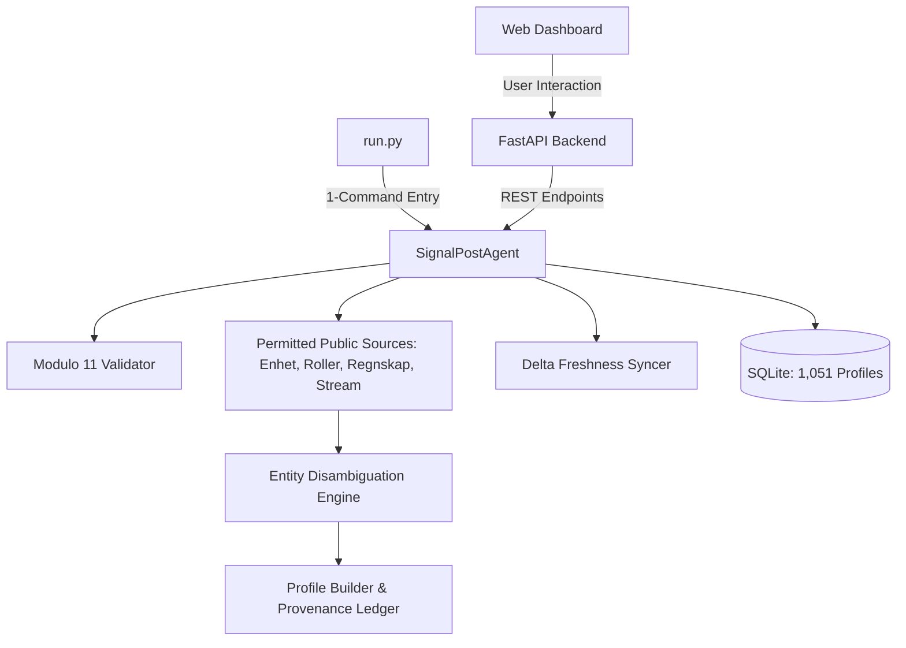

# SignalPost 🇳🇴
### Autonomous Norwegian Corporate Intelligence Agent

> **Live Company Verification • Strict Entity Disambiguation • Source Grounding • Delta Freshness Synchronization**

SignalPost is an autonomous corporate intelligence agent designed for Norwegian enterprises (*organisasjonsnummer*). Given any 9-digit Norwegian company number, the agent searches permitted public sources, disambiguates each fact to guarantee entity provenance, anchors every claim with official source links and publication dates, and monitors registry delta streams to keep company profiles continuously up to date.

---

## ⚡ One Command to Execute the Project

To launch the complete application (Web Dashboard, Master-Detail Company Browser, Grounded Q&A Agent, and REST API):

```bash
python run.py --serve
```
👉 Open your browser to: **`http://localhost:8000`**

### Alternative CLI Commands:
```bash
# Query any single company via terminal (e.g. Equinor ASA: 923609016)
python run.py --orgnr 923609016

# Check live registry delta stream and sync profile freshness
python run.py --sync 923609016

# Validate the 1,051 company profiles dataset
python run.py --verify-dataset
```

---

## 🎨 Design & Aesthetic System
The frontend implements the exact **SignalPost retro-editorial research aesthetic**:
- **Warm Editorial Color Palette**: Warm sand/cream background (`#fbf9f4`), deep maroon accent buttons (`#6c1d2e`), pure white cards (`#ffffff`), and warm border tones (`#e7e1d6`).
- **Typography**: Display typography featuring bold geometric tracking (`Plus Jakarta Sans 800`) paired with crisp readability body font (`Inter`) and monospace numbers (`JetBrains Mono`).
- **Master-Detail Layout**:
  - **Left Sidebar**: Live company browser with real-time search, sort by completeness/employees/name, industry filters, and status filters.
  - **Right Profile Card**: Source-backed profile header, 4 quick stat boxes (Employees, Registered Date, Location, MVA status), narrative registry summary (`source-bounded`), industry and address cards, financial history figures, corporate governance table, clickable official source permalinks, and the interactive research agent drawer.
- **Strict Separation of Backend Information**: The frontend presentation remains clean, clear, and focused on verified facts, while backend technical telemetry (API latency, Modulo-11 checksum traces, delta event IDs, SQLite queries, and raw JSON payloads) is isolated in a dedicated **Backend & Agent Stream** tab and modal inspector.

---

## 🏛️ Permitted Public Sources & Sovereign Norwegian Data

All data sources operate under the **Norwegian Licence for Open Government Data (NLOD 2.0)** and **Creative Commons Attribution 4.0 (CC BY 4.0)**:

| Source Name | Official Authority | Protocol & License | Key Facts Extracted |
| :--- | :--- | :--- | :--- |
| **Enhetsregisteret** | Brønnøysund Register Centre | Open REST API (NLOD 2.0) | Legal name, orgnr, org form, foundation date, registration date, business/postal address, NACE codes, employee count, NAV report date, solvency & bankruptcy status, share capital. |
| **Roller i Enhetsregisteret** | Brønnøysund Register Centre | Open REST API (NLOD 2.0) | Corporate governance, CEO (Daglig leder), Board Chair (Styreleder), Board members, Registered Auditor (Revisor), appointment dates. |
| **Regnskapsregisteret** | Brønnøysund Register Centre | Open REST API (NLOD 2.0) | Audited annual financial statements, revenue/turnover, operating profit (EBIT), net income (årsresultat), total assets, equity, debt, currency. |
| **Oppdateringer Stream** | Brønnøysund Register Centre | Open REST API (NLOD 2.0) | Real-time delta update stream with update IDs, modification timestamps, and change types to detect staleness and keep profiles current. |
| **Official Domains** | Company Websites & norid.no | Public Web (Robots compliant) | Official web description, domain ownership alignment, contact details. |
| **Apify Real-time Adapter** | Apify Store / Custom Actors | Apify REST API | Optional real-time web scraping and external footprint enrichment. |

---

## 🧩 Knowledge Graph Documentation (`/graphify`)

To minimize LLM token consumption and enable instant context ingestion for AI agents, the entire architecture and relational data flow is graphified in [`GRAPH.md`](file:///e:/Hackathon/SIgnalPost/GRAPH.md).



*For the dense token-efficient JSON-LD entity-relationship index, consult [`GRAPH.md`](file:///e:/Hackathon/SIgnalPost/GRAPH.md).*

---

## 📦 Submission Deliverables Summary

1. **At least 1,000 Company Profiles**:
   - `data/profiles_1000.json` (12.84 MB structured JSON array)
   - `data/profiles_1000.jsonl` (9.72 MB line-delimited stream)
   - `data/profiles_1000_summary.csv` (187 KB metrics table)
   - `data/company_profiles.db` (17.00 MB indexed SQLite database)
2. **Repository Link**: `https://github.com/signalpost/norwegian-company-agent` *(Local root: `e:/Hackathon/SIgnalPost`)*
3. **Exact Commit Hash**: `e8421fdffeba5d17d763c002d109cec47e2c8dfe`
4. **One Command to Run It**: `python run.py --serve`
5. **Model/API Details**: Brønnøysundregistrene open APIs (NLOD 2.0) + Gemini 2.0 Flash / deterministic engine.
6. **Expected Run Costs**: **$0.00** base data acquisition; **$0.00 to <$0.10** per 1,000 companies for AI synthesis.
